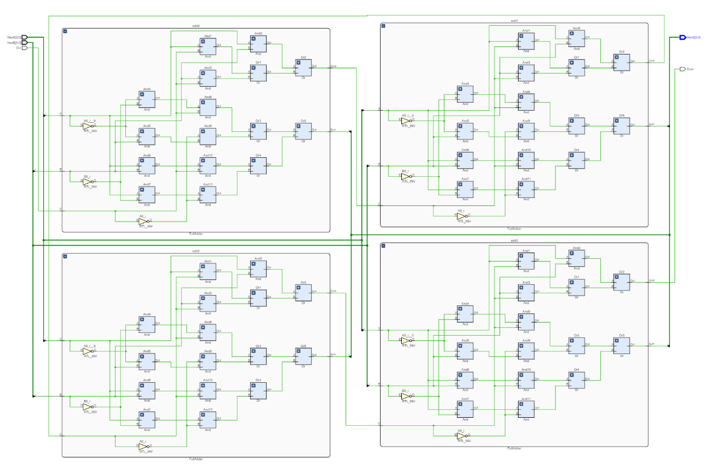

# Lab #2. – Hexadecimal Full Adder

## Objective 
    The purpose of this lab is to review and become familiar with the design and testing of 
    combinational circuits using modular design (block symbols) in a computer-aided design tool. 
    The circuit is to be designed and simulated in XilinxVivado environment.

## Prelab 
    Using solely two-input AND gates and OR gates, implement a Hexadecimal Adder in a 
    modular manner.

## Procedure:
    First, create a binary Full-adder module: 
    Write down the binary full adder truth table Demonstrate you know how to use K-Maps to derive the SOP Boolean equations for 
    Sum and Cout. Implement the obtained equations using ONLY 2-input AND and OR gates. Show the resulting circuit.
    Now, create the Hexadecimal adder Using a block diagram representation of your full adder (corresponding to step 1 above) 
    show how to connect enough instances of it to create a Hexadecimal adder (Circuit that is able to add one hexadecimal 
    digit to another hexadecimal digit). 
    Show the resulting circuit.

## Schematic
